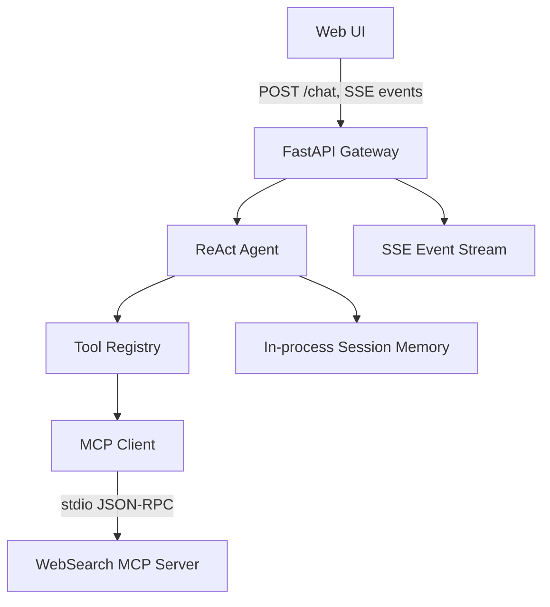

# MCP Agent Platform 开发规格

## 1. 项目目标

构建一个 MCP-native 的多 Agent 调研助手。第一版目标不是做完整平台，而是跑通一条可演示、可测试、可解释的端到端链路：

用户提出技术调研问题，系统通过 Agent 规划、MCP 工具调用、结果整理和流式事件展示，返回结构化 Markdown 报告。

## 2. 当前本机状态

- 当前目录：`D:\demo\MCP-Agent-Platform`
- 当前文件状态：只有 Markdown 规格文档，尚无代码、依赖文件、Docker 配置或 git 仓库元数据。
- 因此本文档从“空目录初始化工程”的角度定义开发框架。

## 3. 范围定义

### 3.1 MVP 必做

- Python 3.11+ 后端工程骨架。
- MCP JSON-RPC 2.0 基础消息模型、错误处理和 `stdio` transport。
- 一个可运行的 MCP Tool Server：`web_search`，第一版可用 DuckDuckGo/SerpAPI/Bing 任一实现，接口保持稳定。
- MCP Client + Tool Registry，能够发现工具并路由 `tools/call`。
- ReAct Agent，支持 Thought、Action、Observation、Final Answer 循环。
- FastAPI 网关，提供 `/chat`、`/tools`、`/health`。
- 浏览器端最小 UI：输入问题、展示回答、展示 Agent 事件流。
- 应用层 SSE，用于前端实时显示 Agent 过程。
- 最小会话记忆：进程内保存当前会话最近消息。
- 单元测试覆盖 JSON-RPC、Tool Registry、ReAct 循环的关键路径。

### 3.2 第一版不做

- 不要求完整实现所有 MCP capability。
- 不要求第一版支持远程 MCP Server。
- 不要求 Redis、ChromaDB、长期记忆、RAG、代码执行沙箱、文件写入工具。
- 不要求多用户账号、权限系统、审计系统。
- 不要求复杂前端框架，前端以可展示为主。

### 3.3 后续增强

- Streamable HTTP transport，用于远程 MCP Server。
- RAGQuery Tool Server：本地文档索引与检索。
- Redis 短期会话记忆。
- ChromaDB 长期记忆。
- Plan-Execute Orchestrator 与多 Agent 协作。
- CodeExec/FileOps/DataAPI 等工具 Server。
- Docker Compose 一键启动。

## 4. 技术栈

| 层级 | 选择 | 说明 |
| --- | --- | --- |
| 语言 | Python 3.11+ | async 支持成熟，AI 生态完善 |
| Web 框架 | FastAPI | API 与 SSE 实现简单 |
| LLM SDK | OpenAI-compatible SDK | 可通过 `base_url` 接 DeepSeek、OpenAI-compatible 服务 |
| MCP 协议 | JSON-RPC 2.0 + stdio | MVP 优先本地工具进程通信 |
| 前端 | HTML/CSS/Vanilla JS | 不引入构建链，降低实现成本 |
| 测试 | pytest + pytest-asyncio | 覆盖异步协议与 Agent 行为 |
| 配置 | pydantic-settings + `.env` | 统一管理密钥、模型、搜索配置 |

## 5. 协议边界

### 5.1 MCP 子集

MVP 实现以下方法：

| Method | 方向 | MVP 要求 |
| --- | --- | --- |
| `initialize` | Client -> Server | 返回 server 信息和 capabilities |
| `notifications/initialized` | Client -> Server | 初始化完成通知，无响应 |
| `tools/list` | Client -> Server | 返回工具名称、描述、inputSchema |
| `tools/call` | Client -> Server | 执行工具并返回 content 或 error |

`resources/*`、`prompts/*`、sampling、roots 等能力暂不实现。

### 5.2 Transport

MVP 只实现 `stdio`：

- 每个 Tool Server 是独立子进程。
- stdin/stdout 传输 JSON-RPC 消息。
- stdout 只输出协议消息；日志必须写 stderr，避免污染协议流。
- 每条消息采用单行 JSON，便于调试和测试。

后续远程 MCP transport 使用 Streamable HTTP。前端看到的 SSE 只是应用层事件流，不作为 MCP transport。

### 5.3 JSON-RPC 要求

- 支持 request、response、notification。
- `id` 原样返回。
- notification 不返回响应。
- 错误码遵循 JSON-RPC 2.0：`-32700`、`-32600`、`-32601`、`-32602`、`-32603`。
- batch request 可作为后续增强，MVP 可先拒绝并返回 Invalid Request。

## 6. 系统架构



### 6.1 数据流

1. 用户在 Web UI 输入问题。
2. `/chat` 创建一次任务，返回 SSE 事件流。
3. ReAct Agent 根据系统 prompt 和工具列表决定下一步。
4. Agent 通过 Tool Registry 调用 MCP 工具。
5. Tool Registry 使用 MCP Client 通过 stdio 调用 Tool Server。
6. 工具结果作为 Observation 回到 Agent。
7. Agent 产出 Final Answer。
8. 网关持续向前端推送 `agent_thought`、`agent_action`、`agent_observation`、`agent_answer`。

## 7. 建议目录结构

```text
mcp_agent_platform/
  mcp/
    __init__.py
    jsonrpc.py
    errors.py
    types.py
    client.py
    server.py
    transport/
      __init__.py
      base.py
      stdio.py
  tools/
    __init__.py
    base.py
    web_search_server.py
  agent/
    __init__.py
    react.py
    tool_registry.py
    prompts.py
    events.py
  memory/
    __init__.py
    session.py
  gateway/
    __init__.py
    app.py
    routes.py
    sse.py
    models.py
  web/
    index.html
    style.css
    app.js
  config/
    __init__.py
    settings.py
tests/
  test_jsonrpc.py
  test_mcp_stdio.py
  test_tool_registry.py
  test_react_agent.py
.env.example
requirements.txt
README.md
```

## 8. 核心模块设计

### 8.1 MCP Server

职责：

- 注册工具元数据。
- 处理 `initialize`、`tools/list`、`tools/call`。
- 校验工具参数。
- 将业务异常转换成 JSON-RPC error 或 MCP tool error content。

### 8.2 MCP Client

职责：

- 启动 Tool Server 子进程。
- 完成 initialize 握手。
- 拉取工具列表。
- 发送 `tools/call` 请求并等待响应。
- 处理超时、子进程退出、协议解析失败。

### 8.3 Tool Registry

职责：

- 管理多个 MCP Client。
- 聚合所有工具列表。
- 根据工具名路由调用。
- 提供 `/tools` 查询需要的数据。

MVP 可以只注册一个 `web_search` server，但接口必须支持多个 server。

### 8.4 ReAct Agent

循环：

```text
while step < max_steps:
  LLM -> Thought + Action 或 Final Answer
  if Action:
    validate action
    call tool
    append Observation
    emit event
  if Final Answer:
    emit answer
    stop
```

约束：

- `max_steps` 默认 6。
- 连续 3 次相同工具和参数则终止。
- 工具调用失败最多重试 1 次。
- Observation 超过长度阈值时截断并摘要。
- 最终回答必须明确引用工具返回来源。

### 8.5 WebSearch Tool

工具名：`web_search`

Input schema:

```json
{
  "type": "object",
  "properties": {
    "query": {"type": "string"},
    "top_k": {"type": "integer", "default": 5},
    "language": {"type": "string", "default": "zh-CN"}
  },
  "required": ["query"]
}
```

Output:

```json
{
  "results": [
    {"title": "...", "url": "...", "snippet": "..."}
  ]
}
```

## 9. API 设计

### 9.1 `POST /chat`

Request:

```json
{
  "session_id": "optional-session-id",
  "message": "对比 Kafka 和 RocketMQ 在金融场景下的适用性",
  "stream": true
}
```

Response:

- `Content-Type: text/event-stream`
- 事件格式见 9.4。

### 9.2 `GET /tools`

Response:

```json
{
  "tools": [
    {
      "name": "web_search",
      "description": "Search web pages for current information.",
      "server": "web-search",
      "inputSchema": {}
    }
  ]
}
```

### 9.3 `GET /health`

Response:

```json
{
  "status": "ok",
  "tools": {"web-search": "ok"},
  "llm": "configured"
}
```

### 9.4 SSE 事件

```text
event: agent_thought
data: {"step":1,"thought":"需要先搜索 Kafka 的金融场景资料"}

event: agent_action
data: {"step":1,"tool":"web_search","input":{"query":"Kafka financial services transactions"}}

event: agent_observation
data: {"step":1,"output":{"results":[...]}}

event: agent_answer
data: {"final_answer":"..."}

event: agent_error
data: {"step":2,"error":"Tool timeout"}
```

## 10. 配置

`.env.example`:

```bash
LLM_API_KEY=
LLM_BASE_URL=https://api.deepseek.com
LLM_MODEL=deepseek-chat

SEARCH_PROVIDER=duckduckgo
SERPAPI_KEY=
BING_SEARCH_API_KEY=

MCP_TOOL_TIMEOUT_SECONDS=30
AGENT_MAX_STEPS=6
SESSION_MEMORY_TURNS=10
```

## 11. 实施计划

### Phase 0：工程初始化

- 创建 Python 包结构。
- 配置 pytest、ruff 或基础格式化。
- 添加 `.env.example`、README 骨架。

验收：

- `pytest` 可运行。
- `python -m mcp_agent_platform.gateway.app` 或等价命令能启动空服务。

### Phase 1：MCP 协议闭环

- 实现 JSON-RPC 编解码。
- 实现 BaseMCPServer。
- 实现 stdio transport。
- 实现 echo 或 web_search Tool Server。
- 实现 MCP Client 调用工具。

验收：

- 单测覆盖 JSON-RPC 成功、错误、notification。
- 命令行能通过 client 调用 `tools/list` 和 `tools/call`。

### Phase 2：Agent 闭环

- 实现 Tool Registry。
- 实现 ReAct Agent。
- 接入 LLM。
- 通过 `web_search` 完成一次简单问答。

验收：

- Agent 能产生至少一轮 Thought -> Action -> Observation -> Final Answer。
- 工具失败时 Agent 能返回可解释错误。

### Phase 3：网关与 UI

- 实现 `/chat` SSE。
- 实现 `/tools`、`/health`。
- 实现 Web UI。
- 展示思考链、工具调用、最终回答。

验收：

- 浏览器可输入问题并看到实时事件。
- 完成一次技术调研问题演示。

### Phase 4：打磨与展示

- 写 README。
- 补充 Demo 脚本和截图。
- 增加 Dockerfile 或 Docker Compose。
- 补充错误处理与超时配置。

验收：

- 新机器可按 README 启动。
- README 与实际能力一致。

## 12. 验收标准

- [ ] `pytest` 全部通过。
- [ ] `tools/list` 返回 `web_search` 的 schema。
- [ ] `tools/call` 可通过 stdio 调用 `web_search`。
- [ ] `/health` 返回服务状态。
- [ ] `/tools` 返回注册工具。
- [ ] `/chat` 返回 SSE 流。
- [ ] 前端展示 Thought、Action、Observation、Final Answer。
- [ ] 一次完整调研任务能在 2 分钟内完成。
- [ ] README 不承诺未实现能力。

## 13. 风险与取舍

| 风险 | 处理 |
| --- | --- |
| MCP 规范持续演进 | MVP 只锁定稳定核心：JSON-RPC、tools、stdio |
| 搜索 API 不稳定 | 抽象 SearchProvider，允许 DuckDuckGo/SerpAPI/Bing 切换 |
| Agent 输出格式不稳定 | 使用严格 prompt + 解析失败重试 |
| 工具进程污染 stdout | 规定日志只写 stderr |
| 第一版范围过大 | Redis、ChromaDB、多 Agent、沙箱执行全部后置 |

